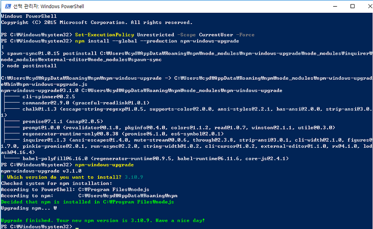

# Node JS

### Node JS 설치&#x20;

#### 0. "02. Developer" 폴더에서 "node-v14.18.1-x64.msi" 실행&#x20;

#### 1. Next 버튼 클릭&#x20;

#### 2. "I accept the terms in the License Agreement" 체크 후 Next 버튼 클릭&#x20;

#### 3. Next 버튼 클릭&#x20;

#### 4. Next 버튼 클릭&#x20;

#### 5. "Automatically install ..." 체크  Next 버튼 클릭&#x20;

#### 6. Install 버튼 클릭&#x20;

#### 7. Finish 버튼 클릭&#x20;

#### 8. 아무 키 입력&#x20;

#### 9. 아무 키 입력&#x20;

#### 10. Powershell 화면이 자동으로 닫힐 때 까지 대기&#x20;

설치가 오래 걸릴 수 있습니다 &#x20;

#### 11. 웹페이지 닫기&#x20;

